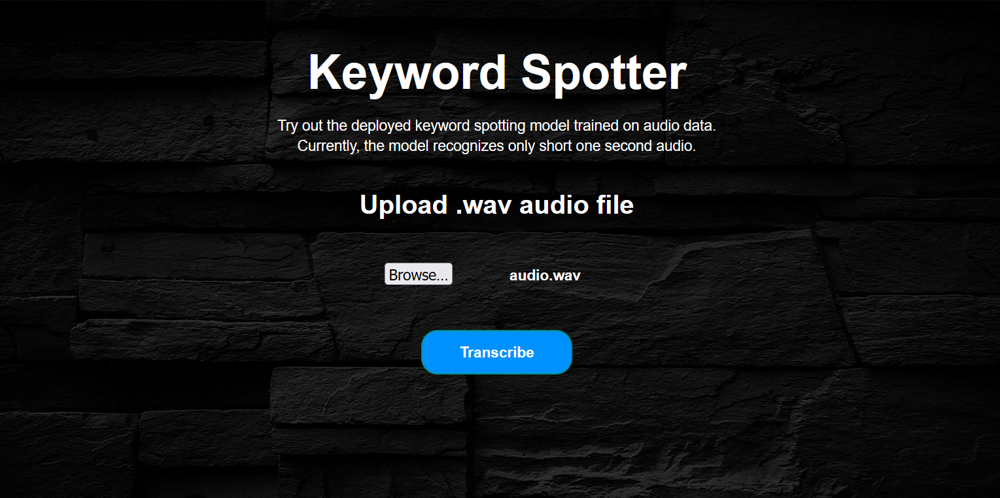
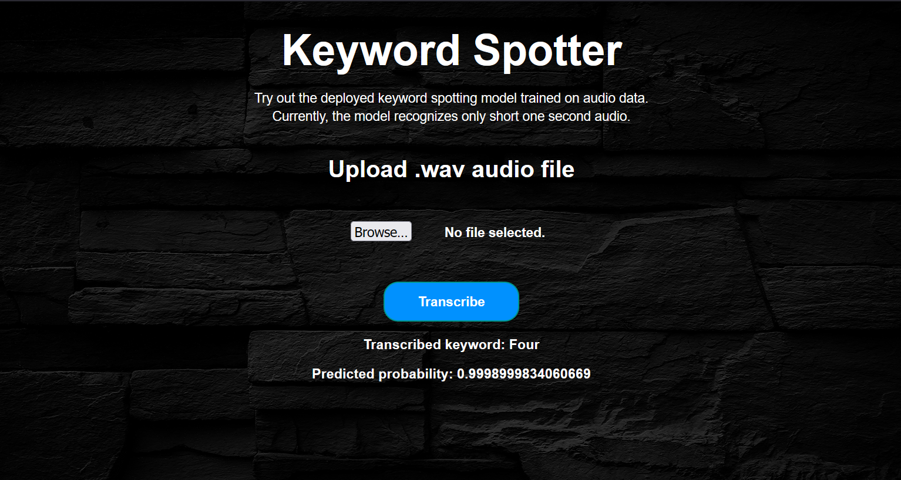
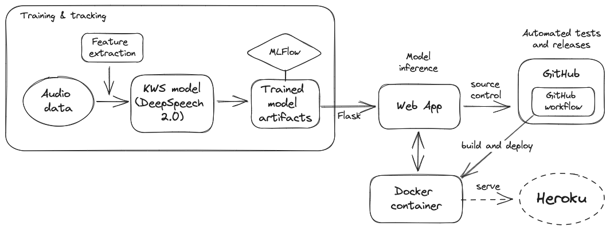

<h1 align="center">
    End-to-end small footprint keyword spotting application
</h1>

---

This project defines a pipeline that **trains** an end-to-end small footprint keyword spotting model using input audio files, **tracks** experiments by logging the model artifacts, parameters and metrics, **builds** them as a web application. Then, **dockerizes** the application into a container and deploys it, together with the trained model artifacts into a cloud server with **CI/CD** integration, automated tests and releases.

## Keyword Spotting App - Demo





## Description

The project has consisted of implementation of existing research (audio signal processing, keyword spotting, ASR), development (audio data processing, deep neural network training, evaluation) and deployment (building model artifacts, web app development, docker, cloud PaaS) by integrating `CI/CD` pipelines with automated releases and tests.



## Technical details

The codebase:

1. Handles and maintains configurations across the application using `Hydra`.
2. Trains a deep end-to-end `CNN-LSTM` neural network on `Google Speech command dataset` using `Tensorflow` to detect keywords or short one-second utterances.
3. Tracks the entire model training using `MLflow` from which  `trained model artifacts`, metrics and parameters are logged.
4. Builds a web app using `Flask` that provides an intuitive interface to make predictions from the trained model using real audio data.
5. Automates `CI/CD Pipeline` as follows:
    - Initializes `GitHub Actions` workflows for CI. This triggers the pipeline whenever it tracks a new commit to the repository.
    - Performs automated tests using `pytest` after every commit to the `main` branch.
    - Runs the pipeline, which builds the entire application along with the model to the docker image and then containerizes into a `Docker container`.
    - A new release is created automatically when tags are pushed to the repository using `release.yaml`
    - The app is deployed to a cloud provider
    - The user can access the app via `URL`. The app facilitates to upload an input short `audio .wav file`, in which the predicted keyword is returned from the model along with the probability and displayed as a result in the app UI/webpage.

## Pipeline

[Keyword Spotting](https://arxiv.org/ftp/arxiv/papers/1703/1703.05390.pdf) (KWS) is the task of detecting a particular keyword from speech. As an example, current voice-based devices such as **Amazon Alexa**, **Google Home** etc. first detect the predefined keywords (wakewords) from the speech locally on the device. When such keywords are detected, a full scale automatic speech recognizer is triggered on the cloud for further recognition of entire speech and processing.

### Dataset & feature extraction

The [Google Speech command dataset](https://www.kaggle.com/competitions/tensorflow-speech-recognition-challenge/data) via Kaggle is used for this project. It consists of $65,000$ one-second long utterances. In our case, the model will be trained on $25$ keywords or short words.

We use [Mel-Frequency Cepstral Coefficients](https://en.wikipedia.org/wiki/Mel-frequency_cepstrum) (MFCC), which is the most common feature extraction technique for audio data. [data.py](./src/data.py) contains the code for preprocessing audio files and extracting features. It reads the audio sequence, computes MFCC and pads for a fixed-sized vector for all audio files, since CNN cannot handle sequential data.

### Model

The end-to-end model used in this project is inspired from [Deep Speech 2.0](https://arxiv.org/pdf/1512.02595.pdf). *Deep speech 2.0* is proposed for end-to-end ASR tasks which consists of set of `1D or 2D convolutional layers` followed by set of `recurrent` or `GRU` layers and set of fc layers. The main advantage is that it uses `batch normalization`, even in the `recurrent` layers.

A similar kind of model is developed for this work with some changes. We define an end-to-end model that accepts audio MFCC features as input and outputs label probabilities to recognize keywords. The usage of CTC loss function is feasible, only if the model size is very large in order to learn from a large dataset. Since this is a `KWS task` and considering the model and dataset size, the CTC loss function is replaced with `categorical cross-entropy` as it predicts the most probable keywords instead of entire long utterance.


## Run the inference app locally

[app.py](./app.py) creates a web application that wraps the trained model to be used for `inferencing` using `real audio data` by means of `Flask`. 

Run locally using Docker and Makefile:

```bash
make build
make run
```

Use audio files from the [test directory](./dataset/test/) for local inferencing or download the full test-set from [here](https://www.kaggle.com/competitions/tensorflow-speech-recognition-challenge/data).

## References

- [Convolutional Recurrent Neural Networks for Small-Footprint Keyword
Spotting](https://arxiv.org/ftp/arxiv/papers/1703/1703.05390.pdf)
- [Speech: A Challenge to Digital Signal Processing Technology
for Human-to-Computer Interaction](https://arxiv.org/ftp/arxiv/papers/1305/1305.1925.pdf)
- [Deep Speech 2.0](https://arxiv.org/pdf/1512.02595.pdf)
- [Google Speech command dataset - Kaggle](https://www.kaggle.com/competitions/tensorflow-speech-recognition-challenge/data)
